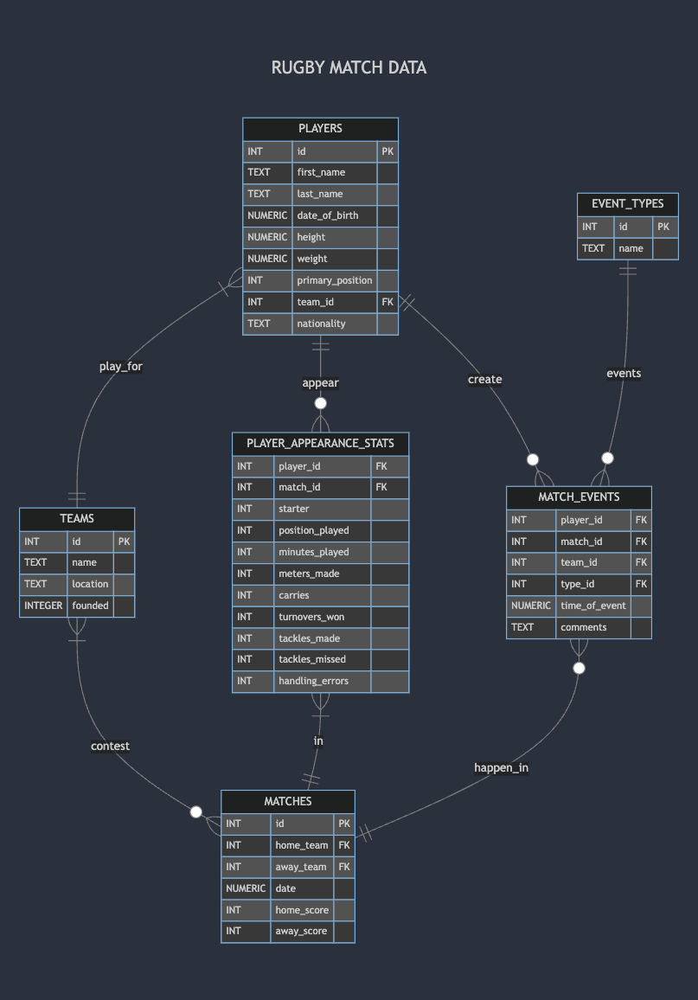

# Design Document

By Anthony Squire

Video overview: <URL https://youtu.be/fm_yX-gBPus>

## Scope

The database produced is for rugby union match data. It includes entities to allow for the tracking of match results and various statistics relating to the teams, matches and players.

Included in the scope of this database are:
* Teams, with basic identifying information.
* Players, with identifying information and characteristics such as height, weight. etc.
* Matches, showing home and away team, the score for each and the time of the match
* Player appearance statistics, to track various rugby statistics relating to players performances in each match they play.
* Event types, the various significant things that can happen in a match and are typically tracked for statistical/broadcasting/reporting purposes.
* Match events, to track when in the match the event occurs, who it relates to etc. (e.g. a player scores a 'Try')

Outside the scope of this database is tracking team statistics such as lineouts won/lost, scrums won/lost etc. and also tracking players changing teams.

## Functional Requirements

The database should support:

* CRUD operations for teams, students, matches, stats, events
* Generating statistics for player's performances
* Find top performing players in whichever performance criteria they choose to analyse
* Tracking match results as well as what happened in them (who scored what and when, substitutions, yellow/red cards, penalties etc.)
* Showing current league standings of the teams

This version of the database does not directly support tracking matches across multiple competitions/leagues or seasons

## Representation

### Entities

#### Teams
The `teams` table includes:

`id`, specifying a unique id for each team as an `INTEGER`. This column is assigned the `PRIMARY KEY` constraint.
`name`, specifying the teams name as `TEXT` as this is appropriate for name fields. It also has the `UNIQUE` constraint to ensure no two teams have the same name.
`location`, specifying the teams location as `TEXT`, ideally an address.
`founded`, specifying the year the team was founded as an `INTEGER` as only the year will be recorded which can be represented as an integer.

#### Players
The `players` table includes:

`id`, specifying a unique id for each player as an `INTEGER`, this column is therefore assigned the `PRIMARY KEY` constraint.
`first_name`, specifying the players first name as `TEXT` as is appropriate for name fields.
`last_name`, specifying the players last name as `TEXT` as is appropriate for name fields
`date_of_birth`, specifying the players date of birth. Dates can be stores as `NUMERIC` in SQLite3
`height`, specifying the players height in cm therefore `NUMERIC` is appropriate as it allows for floats.
`weight`, specifying the players weight in kg therefore `NUMERIC` is appropriate.
`primary_position`, specifying the players primary position. In rugby the positions are named, but also numbered from 1 to 15, so `INTEGER` is specified with a `CHECK` constraint to ensure the value is between 1 and 15.
`nationality`, is specifying the players nationality should they be selected for international duties, this is typically recorded by 3 letters e.g. 'ENG' for england so `TEXT` was deemed appropriate.
`team_id`, the id of the team that the player plays for. Hence this column has the `FOREIGN KEY` constraint referenceing the `id` column in the `teams` table.

`NOT NULL` is applied to all but the height, weight and nationality columns incase that players do not wish to disclose this information, but the other attributes are required to be able to better identify them in the case of two players with matching names.

#### Matches
The `matches` table includes:

`id`, specifying a unique id for each match as an `INTEGER` which is then assigned as the `PRIMARY KEY` constraint.
`home_team_id`, an `INTEGER` recording the id of the home team assigned as a `FOREIGN KEY` referencing the `id` column of the `teams` table.
`away_team_id`, an `INTEGER` recording the id of the away team assigned as a `FOREIGN KEY` referencing the `id` column of the `teams` table.
`date`, to record the date and kick off time of the match as a `NUMERIC` datatype as per SQLite3's documentation.
`home_score`, to record the home teams score in the match, scores can only be whole numbers to `INTEGER` is appropriate.
`away_score`, to record the away teams score in the match, scores can only be whole numbers to `INTEGER` is appropriate.

#### Event Types
The `event_types` table includes:

`id`, specifying a unique id for each event type as an `INTEGER` which is then assigned the `PRIMARY KEY` constraint.
`name`, specifying a name for the event that can occurr in a match and is wanted to be tracked. `TEXT` is appropriate for storing of names/phrases.

The `event_types` was made to reduce the amount of repitition of strings in the `match_events` table as certain events will happen numerous times in each match.

#### Match Events
The `match_events` table includes:

`match_id`, specifying the match id each match event took place in as an `INTEGER`  which is then assigned the `FOREIGN KEY` constraint referencing the `matches` table's `id` column.
`player_id`, specifying the id of the player responsible for the match event as an `INTEGER` which is assigned the `FOREIGN KEY` constraint referencing the `players` table's `id` column.
`team_id` specifying the team which the match event relates too as an `INTEGER` which is assigned the `FOREIGN KEY` constraint referencing the `teams` table's `id` column. This could be deduced from the players `id` but including it in this table can often make queries simpler when looking for events relating to a specific team.
`game_time` specifying the time in minutes and seconds that the event took place in the game. Times can be stored as a `NUMERIC` datatype.
`type_id` specifying the event type id for the event recording as an `INTEGER` then assigned as a `FOREIGN KEY` referencing the `event_types` table's `id` column.

All columns are allocated the `NOT NULL` constraint as they are all required to correctly record the event.

#### Player Appearance Stats
The `player_appearance_stats` table includes:

`player_id`, specifying the id of the player responsible for the match event as an `INTEGER` which is assigned the `FOREIGN KEY` constraint referencing the `players` table's `id` column.
`match_id`, specifying the match id referencing the match the performance stats realte to as an `INTEGER`  which is then assigned the `FOREIGN KEY` constraint referencing the `matches` table's `id` column.
`starter`, specifying whether the player started the match or was on the bench. This is in effect a true/false so an `INTEGER` type is used with a check for 0 or 1 with 0 representing false (player did not start the game) and 1 representing true.
`position_played`, specifying what position the player played in the game. As seen previously the positions are represented from 1 to 15 so an `INTEGER` type was chosen with a check for the value being in the 1 to 15 range.
`minutes_played`, specifying the number of whole minutes of game time the player played. As this will be whole numbers, `INTEGER` is appropriate for this.
`meters_made`, specifying the number of meters forward the player carried the ball in the game. Again this will be recorded as whole meters so `INTEGER` is appropriate.
`carries`, specifying the number of times the player carried the ball in the martch, hence `INTEGER` again.
`turnovers_won`, specifying the number of times the player won the ball from the opposition as a whole number, so `INTEGER` is again chosen.
`tackles_made`, specifying the number of tackles the player successfully completed. `INTEGER` again chosen as this can only be whole numbers.
`tackles_missed`, specifying the number of tackles the player missed in the game. `INTEGER` again chosen as this can only be whole numbers.
`handling_errors`, specifying the number of handling errors the player made in the game. `INTEGER` again chosen as can only be whole numbers.

In this table `NOT NULL` is not specified for the statistics recorded as it could occur that some would be `NULL` or 0 if a player did not do them. `NOT NULL` is specified for the playe, match and starter columns, the first two as these are necesary to identify the player and which game the performance stats occurred and starter to ensure an entry is put here.

### Relationships

As can be seen in the diagram:

* A team must have many players related to it, but each player can only represent one team.
* Teams can play in 0 or many matches but any match must have 2 teams.
* Players can have 0 appearances if they haven't played a game or many appearance statistics if they have played multiple matches. The same can be said for match events.
* Individual match events must be related to one and only one match and event type. But an event type may not occur in any match, or could occur multiple times. Similarly, though unlikely, a match could have zero events occur (for example a 0-0 draw with no penalties attempted, no substitutes etc. or simply the database user isn't wanting to track many events) or more likely there will be many events!
* Player appearance stats must be associated to one and only one match and player as the statistics are only relevant to one person and one match, but a match requires at least 30 players so for every match there must be multiple appearance stats linked to each one match.

## Optimizations

An index was created on the `players` tables `first_name` and `last_name` columns as these will be used regularly in queries to see their relevant stats, and match events that tey were involved in. Similarly queries will be run relating to a teams name so a further index was created on the `teams` `name` column.

A `top_try_scorers` view was created to quickly be able to check the top scorers, this is something that is often tracked in a league. It was done by checking the match_events table for events named `Try Scored` (though a different user may use different names for such an event) and counting them then grouping them by player id. Returning the top 10 in descending order.

A regular performance statistic is also tackle percentage, a view `tackle_percentage` was made to show the players with the best tackle completion rates in the league. The average tackles made and missed per game were calculated from the `player_appearance_stats` table and then the tackle rate from the total tackles made/missed by each player. This was converted to a float by multiplying by 1.0 then round to 2 signifcant figures. Again the results were grouped by player id and ordered by the calculated completion rate with the top 10 shown in descending order.

Leagues will represent standings in a league table. A `league_table` view was made to show the current league standings including matches played, won, drawn and lost for each team and then the total points they have accrued (4 for a win and 2 for a draw) and ordered by those points. The wins/draws/losses were found by getting the sum of the matches where each team id matched either the home or away id and then comparing it to the other team in that match with the relevant logical operators as to whether it will be counted. The points were calculated by repeating the wins and draws sums and multiplying by 4 and 2 respectively.

## Limitations

The current design is only really appropriate for tracking a single competition/league and it is also difficult to represent other scoring systems for league points (for instance it is common for a bonus point to be awarded to a team if they score 4 or more tries in one match).

Also, it is somewhat common for players to change teams as their contracts expire or they are traded which in this iteration can not be easily tracked/recorded.
